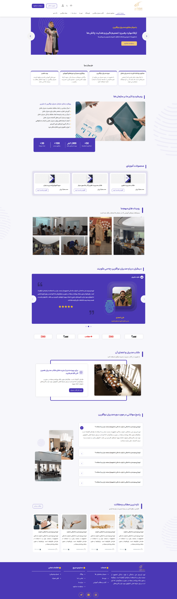

# Project Title — WordPress Website

A professional WordPress website built for [Client/Platform Name].  
Showcases key services, products, and content online.

---

## 🌐 Live Website
[https://modiranenoafarin.com](https://modiranenoafarin.com)

---

## ✨ Features
- Responsive design (desktop & mobile)  
- Online store / course listings (WooCommerce)  
- Contact / request forms  
- Blog or content section  
- SEO-friendly setup  

---

## 📸 Screenshots
  
  

---

## 👩‍💻 My Role
- Theme setup and customization  
- Plugin installation and configuration  
- Page layout and content addition  
- Mobile optimization & SEO basics  

---

## 🔗 Links
- Live site: [https://example.com](https://example.com)  
- GitHub: [Repository link](https://github.com/username/repo)
